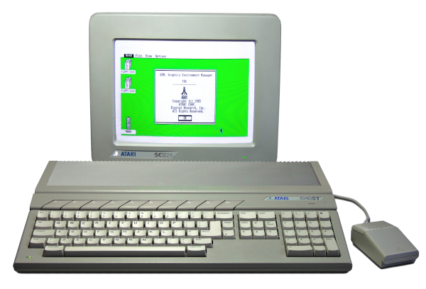

# EstyJS

Emulator for the Atari ST, written in 100% pure JavaScript, originally developed by Darren Coles.
Maintained by Kai Eckert since 2024.

Runs here: [https://kaiec.github.io/EstyJS/](https://kaiec.github.io/EstyJS/)

## Using it

- [Disk images](using/disks.md)
- [Keyboard](using/keyboard.md)
- [Joystick](using/joystick.md)
- [Limitations](using/limitations.md)

## Working on it

- [Tools](inside/tools.md)

## About

- [Releases](releases.md)
- [Credits and license](credits.md)

## Atari ST

The Atari ST was a 16 bit home computer that was very popular in the late 80's and early 90's.
It was the direct competitor of the Commodore Amiga and both machines were based upon the 68000 CPU.
It was first released in 1985 and was very sucessful in the professional music industry due to
having MIDI ports as standard.

## These pages

Markdown files under `docs/`, rendered in the browser by [`docs.html`](../docs.html) using
[marked](https://github.com/markedjs/marked). No build step. The navigation is the link list above.
